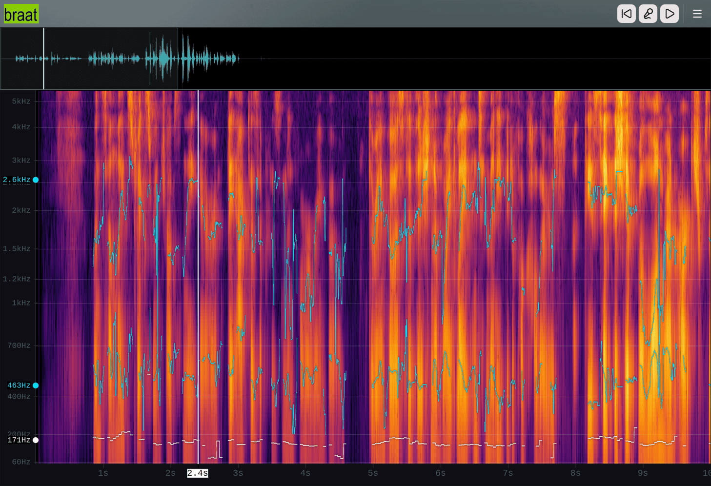

# 

## What is Braat?

Braat shows you, in real time, the pitch and resonance of your voice as you speak. It's a practice aid aimed at **voice training** — including trans voice training, where pitch (F0) and vowel resonance (F1-3) are commonly used reference points. It may also be useful for singing practice, accent work, or just exploring how your voice works.

[**Open Braat →**](https://braat.app)



## Why Braat?

Braat's signal-processing algorithms are adapted from [Praat](https://www.fon.hum.uva.nl/praat/), a widely used tool in phonetics research. Praat is primarily oriented toward offline analysis; Braat takes its algorithms and runs them on a live microphone in the browser, with no install and no upload.

## Features

- **Live spectrogram** — your voice's frequency content as you speak
- **Pitch (F0) tracking** — Praat's filtered autocorrelation method
- **Formant (F1-F3) tracking** — Burg's method LPC, plotted on a vowel chart
- **Voice activity detection** — Silero VAD picks out voiced segments
- **File import** — drop in a recording and analyze it offline
- **Private** — audio stays in your browser; nothing is uploaded
- **Offline** — once loaded, works without a network connection

## Browser support

Braat uses AudioWorklet, Web Workers, and SharedArrayBuffer, which need a recent browser (Chrome, Firefox, or Safari).

## Status

Braat is **alpha and in active development**. Core features work, but expect changes to the UI and algorithms. A usage guide is planned but not yet written.

## How it works

All audio processing happens in the browser. An AudioWorklet captures microphone PCM into a SharedArrayBuffer ring, and three Web Workers read from it in parallel:

- a spectrogram worker (FFT-based, with a Bark-scaled colormap),
- a formant worker running pitch (filtered autocorrelation) and formant (Burg LPC) analysis,
- and a VAD worker running Silero v6 via ONNX Runtime Web.

DSP code ported from Praat via LLM is attributed in each source file's copyright header.

## Common Commands

```bash
# Development
npm run dev            # Run dev server on port 3000
npm run build          # Build for production

# Code Quality
# Prefer `npm run check` over running the underlying tools (oxlint, oxfmt)
# directly: it bundles format + lint-fix into one step.
# Note: `npm run check` or oxlint is how you typecheck, tsgo isn't installed directly.
npm run check

# Testing
npm run test           # Run tests with Vitest
npm run e2e            # Run slow end-to-end tests
npm run test -- --silent=false --disable-console-intercept  # Show logs

# Reference media
npm run media:fetch    # Mirror reference clips into media/references/ (see below)
```

## Tech Stack

- **UI Framework**: TanStack Router (React 19 SPA with file-based routing under `src/routes/`)
- **Styling**: Tailwind CSS v4 (via `@tailwindcss/vite` plugin)
- **Components**: shadcn/ui with [Base UI](https://base-ui.com/) (not Radix), configured via `components.json` (`"style": "base-nova"`). Components are vendored into `src/components/ui/` with minor local changes on top.
- **Icons**: lucide-react

## Key Architectural Decisions

1. **Real-time Priority**: Spectrogram, waveform, and formant data must remain responsive. Slower computations should not block visualization. If necessary, defer or make features optional rather than blocking the UI.

2. **Audio Worklet for Low-Latency**: Realtime DSP runs in an AudioWorklet; UI and DSP communicate via message passing (not direct function calls).

3. **Vendored DSP Code**: Algorithms are ported to TypeScript from reputable sources (primarily Praat) with clear attribution. Avoid WebAssembly when reasonable TypeScript alternatives exist.

4. **Stream & Batch Processing**: Each algorithm should provide:
   - A stream wrapper (avoids array allocations during processing when possible)
   - A batch wrapper (for offline/file import processing)

5. **Browser-Only**: All processing runs in the browser. The server only builds and serves static assets.

## Adding UI Components

To add new shadcn/ui components (pulled from the Base UI registry configured in `components.json`):

```bash
npx shadcn@latest add <component-name>
```

Components are vendored into `src/components/ui/` and can be imported directly. We carry minor local changes on top of the generated code, so review diffs before re-adding or updating a component.

## Reference Media (media.braat.app)

The practice route plays ~140 MB of synthesized reference clips (per-sentence
MP3s). These are not in the repo. `media.braat.app` holds them, along with `manifest.json`.

- **Generating clips**: `npm run synth:references`, very slow
- **Fetching clips**: `npm run media:fetch`
- **Local development**: flip `USE_LOCAL_MEDIA` to use local references
- **URL resolution**: see `src/lib/mediaConfig.ts`
- **Host headers**: `media/_headers` (tracked) sets cross-origin isolation headers
  Grebedoc adds Content-Type, caching, and ACAO automatically.

## Analytics

Anonymous, cookieless usage stats via GoatCounter, via `src/lib/analytics.ts`
(`trackPageview` / `track`). Events have no properties, so dimensions are
encoded into the event name (`family/value`) from a small, fixed set.
See `src/routes/privacy.tsx` for the user-facing disclosure. Do Not Track /
GPC are intentionally ignored. It's not really aiming to stop first-party,
anonymous counts. See https://www.arp242.net/dnt.html.

## CI/CD

CI runs on Forgejo (Codeberg) via `.forgejo/workflows/ci.yaml`. The workflow lints, tests, builds, and deploys to Grebedoc on every push to `main`.

Forgejo supports GitHub Actions syntax, but compatibility with third-party marketplace actions is not guaranteed. Prefer runner-agnostic shell steps where possible.

## Nix

You can use [`just`](https://github.com/casey/just) and `nix` for a known-good setup.

Common tasks are wrapped as `just` recipes (run `just` to list them):

| Recipe         | Action                                           |
| -------------- | ------------------------------------------------ |
| `just install` | Install dependencies (via lockfile)              |
| `just dev`     | Dev server on port 3000                          |
| `just build`   | Production build into `dist/`                    |
| `just test`    | Vitest unit suite                                |
| `just e2e`     | Slow end-to-end tests                            |
| `just check`   | Format + lint-fix                                |
| `just ci`      | Full CI-equivalent gate (lint, test, e2e, build) |

### Option 1: Devcontainer (VS Code / Codespaces)

Open the repo in VS Code and **Reopen in Container**, or launch a GitHub
Codespace. The container ([`.devcontainer/`](.devcontainer/)) builds from
`nixos/nix`, auto-loads the flake devshell in every terminal via direnv, and runs
`just install` on creation. Once it's up:

```bash
just dev
```

### Option 2: direnv + Nix (auto-loading, local)

With [Nix](https://nixos.org/download) (flakes enabled) and
[direnv](https://direnv.net) + [nix-direnv](https://github.com/nix-community/nix-direnv)
installed, the devshell loads automatically on `cd` — the repo ships an `.envrc`
(`use flake`):

```bash
direnv allow      # one time, trusts the .envrc
just install
just dev
```

### Option 3: Plain Nix (no direnv)

```bash
nix develop           # enter the devshell (Node 22 + just)
just install
just dev
```

Or run a single command without entering the shell: `nix develop -c just ci`.

## Contributing

Source and issue tracker: <https://codeberg.org/jocelyn-stericker/braat>

Code, bug reports, or feedback from using it, are welcome.

## License

Copyright (C) 2026 Jocelyn Stericker <jocelyn@nettek.ca>

This program is free software: you can redistribute it and/or modify
it under the terms of the GNU Affero General Public License as published by
the Free Software Foundation, either version 3 of the License, or
(at your option) any later version.

This program is distributed in the hope that it will be useful,
but WITHOUT ANY WARRANTY; without even the implied warranty of
MERCHANTABILITY or FITNESS FOR A PARTICULAR PURPOSE. See the
GNU Affero General Public License for more details.

You should have received a copy of the GNU Affero General Public License
along with this program. If not, see <https://www.gnu.org/licenses/>.

This project contains code derived from Praat. That code is:

Copyright (C) 1992-2008,2011,2012,2015-2020,2022-2024 Paul Boersma

Copyright (C) 1993-2020 David Weenink

This project also contains a TypeScript port of the **Bournemouth Forced
Aligner (BFA)** for phoneme-level forced alignment, in
[`src/lib/alignment/`](src/lib/alignment/).
The upstream BFA is:

Copyright (C) Tabahi <tabahi@duck.com>

The upstream BFA is licensed under GPLv3; this port is distributed under
AGPL-3.0-or-later. It runs the CUPE acoustic model via onnxruntime-web; the
model weights are not bundled. See
[`src/lib/alignment/README.md`](src/lib/alignment/README.md)
and
[`ATTRIBUTION.md`](src/lib/alignment/ATTRIBUTION.md)
for details.
